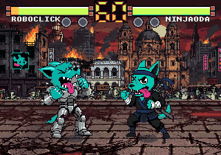
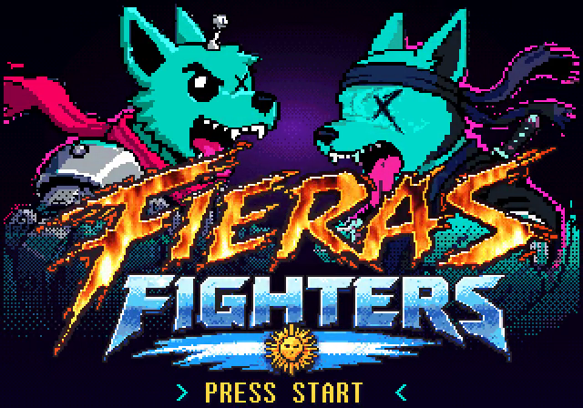
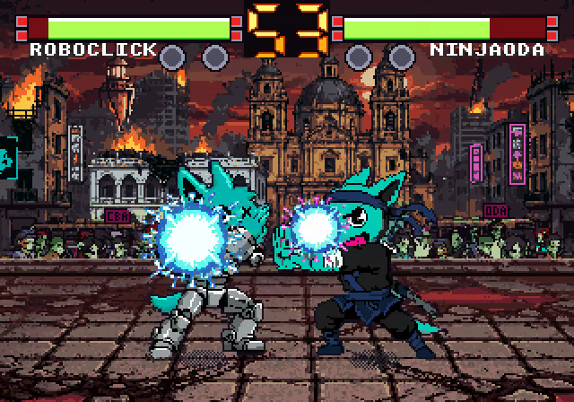

# FIERAS FIGHTERS

[Español](#español) · [English](#english)



Juego de pelea 1 contra 1 para Neo Geo, al estilo de The King of Fighters. ROBOCLICK (el perro cyan de Odaclick en versión cyborg) pelea contra NINJAODA (el mismo perro, de ninja) en una Córdoba capital postapocalíptica.

Lo hice con IA en unas 14 horas, desde la idea hasta que se pudo jugar. De esas horas, 5,33 fueron de trabajo mío y durante 4 estuve durmiendo mientras la IA seguía.

<!-- VIDEO -->

| | |
|---|---|
|  |  |

## Español

### Los números

| | |
|---|---|
| Reloj, de la idea al juego jugable | 13,97 h (13 h 58 min), del 25/09 21:48 al 26/09 11:46, hora de Argentina (UTC-3) |
| Mi tiempo activo | 5,33 h (5 h 20 min) |
| Durmiendo mientras la IA trabajaba | 4,17 h (de 00:44 a 04:54) |
| Prompts | 75 |
| Arte final en el juego | 180 PNG |
| Arte descartado y crudos | unos 25.700 archivos, entre ellos 51 videos de animación |
| Código | unas 3.350 líneas de C y ensamblador Z80 escritas con la IA, más unas 1.060 generadas por las herramientas de conversión |

El reloj va desde mi primer mensaje sobre este juego hasta el último. El tiempo activo suma los intervalos entre mis prompts y descarta los que pasan de 30 minutos, así que se queda corto: no cuenta el rato que pasé mirando o jugando sin escribir. Antes de esas 14 horas le dediqué unas 2 a aprender a programar para Neo Geo y armar el build base con un shooter de prueba. Esas no están en la cuenta.

### Bitácora

| Hora | Etapa | Prompts | Qué salió |
|---|---|---|---|
| 25/09 21:48 | Idea | 6 | "¿Se puede hacer algo tipo KOF para Neo Geo?" Qué se puede lograr y sobre qué base |
| 23:12 a 00:30 | Prototipo | 3 | Pelea 1v1 con capas y parallax: golpes, bloqueo, bola de energía, barras, reloj y K.O. |
| 00:30 a 00:44 | Personajes | 5 | El perro de Odaclick en versión robot y ninja, Córdoba postapocalíptica y una tribuna de zombies alentando |
| 00:44 a 04:54 | Yo dormía | 0 | La IA siguió sola: pasó el arte real al juego y le dio arte propio a la bola de energía, la guardia y el golpe bajo |
| 04:54 a 05:09 | Nombres | 6 | Los perros pasan a llamarse ROBOCLICK y NINJAODA. Primer video |
| 05:09 a 09:20 | Presentación | 24 | Intro con el logo de Odaclick, logo de FIERAS FIGHTERS con fuego, título VS con bustos, menú, selector de personajes, efectos de golpe, música y sonido |
| 09:20 a 10:23 | A mano | 15 | Retoques de los bustos en GIMP, la X en el ojo y los retratos enfrentados |
| 10:23 a 11:46 | Cierre | 16 | Jugarlo, validarlo, grabar un video de muestra y armar el paquete para compartir |

### Qué hice yo a mano

- La dirección de arte: el perro cyan con la lengua afuera y la X en el ojo, los dos perros enfrentados, la Córdoba postapocalíptica, el logo en llamas y el esfumado del título.
- Las referencias: la imagen del perro y el logo de FIERAS FIGHTERS.
- Retoques de píxeles en GIMP sobre los bustos del título, incluida la X del ojo.
- Elegir entre las variantes de bustos, retratos y del ojo de ROBOCLICK.
- Jugarlo, validarlo y marcar lo que no andaba.

El código, el arte, las animaciones, la música y los efectos de sonido los hizo la IA.

### Con qué se hizo

El código se escribió con [Claude Code](https://claude.com/claude-code). El arte se generó con [ComfyUI](https://github.com/comfyanonymous/ComfyUI) en una PC local y después lo retoqué a mano. El toolchain es [ngdevkit](https://github.com/dciabrin/ngdevkit) (C para el 68000 y un driver de sonido para el Z80), y el juego corre en [MAME](https://www.mamedev.org/).

`tools/` convierte los PNG de `art/src/` a los formatos de la Neo Geo: tiles, paletas de 15 colores y animaciones.

### Jugarlo

Sin compilar: bajá el zip del [último Release](../../releases/latest). Trae la ROM y nullbios, un BIOS libre, así que no hace falta conseguir nada más.

- Windows: descomprimí el zip adentro de la carpeta de [MAME](https://www.mamedev.org/release.html), al lado de `mame.exe`, y hacé doble clic en `fieras-fighters\JUGAR.bat`.
- Mac y Linux: con MAME instalado, desde la carpeta descomprimida:
  ```sh
  mame aes -cart fighter -rompath roms -hashpath hash -ctrlrpath ctrlr -ctrlr teclado -window
  ```

| | mover | golpe | patada | START |
|---|---|---|---|---|
| Jugador 1 | flechas | `Z` | `X` | `1` o `Enter` |
| Jugador 2 | `R` `F` `D` `G` | `A` | `S` | `2` |

Bola de energía: abajo, abajo-adelante, adelante + golpe. En el selector, golpe elige el color normal y patada el alternativo. El jugador 2 entra cuando quiera con su START.

### Compilarlo

Necesita [ngdevkit](https://github.com/dciabrin/ngdevkit) instalado (con `brew` en Mac, o con apt en Ubuntu 24.04 o más nuevo).

```sh
source env.sh                  # en Mac: GNU make 4 y python3 de brew
autoreconf -i && ./configure
make art                       # opcional: regenera los datos desde art/src/
make                           # ROM en build/rom/
make mame                      # jugar
```

### Licencia

El código es MIT (ver [LICENSE](LICENSE)). El arte, los personajes y la marca Odaclick tienen todos los derechos reservados.

## English

A 1v1 Neo Geo fighting game in the style of The King of Fighters. ROBOCLICK (Odaclick's cyan dog as a cyborg) fights NINJAODA (the same dog as a ninja) in a post-apocalyptic Córdoba, Argentina.

I made it with AI in about 14 hours, from the idea to a playable game. I was actively working for 5.33 of those hours, and I slept through 4 of them while the AI kept going.

### The numbers

| | |
|---|---|
| Wall clock, idea to playable | 13.97 h (13 h 58 min), Sep 25 21:48 to Sep 26 11:46, Argentina time (UTC-3) |
| My active time | 5.33 h (5 h 20 min) |
| Asleep while the AI worked | 4.17 h (00:44 to 04:54) |
| Prompts | 75 |
| Final art in the game | 180 PNGs |
| Discarded and raw art | about 25,700 files, including 51 animation videos |
| Code | about 3,350 lines of C and Z80 assembly written with the AI, plus about 1,060 generated by the conversion tools |

Wall clock runs from my first message about this game to my last. Active time adds up the intervals between my prompts and skips any gap longer than 30 minutes, so it runs low: it leaves out time I spent watching or playing without typing. Before those 14 hours I spent about 2 learning Neo Geo development and setting up the base build with a test shooter. Those aren't counted.

### Log

| Time | Stage | Prompts | What came out |
|---|---|---|---|
| Sep 25 21:48 | Idea | 6 | "Can we make something like KOF for the Neo Geo?" What's feasible and what to build on |
| 23:12 to 00:30 | Prototype | 3 | 1v1 fight with parallax layers: punches, blocking, fireball, life bars, timer and K.O. |
| 00:30 to 00:44 | Characters | 5 | Odaclick's dog as a robot and a ninja, post-apocalyptic Córdoba and a crowd of cheering zombies |
| 00:44 to 04:54 | I was asleep | 0 | The AI kept going on its own: it brought the real art into the game and gave the fireball, block and low punch their own art |
| 04:54 to 05:09 | Names | 6 | The dogs become ROBOCLICK and NINJAODA. First video |
| 05:09 to 09:20 | Front end | 24 | Odaclick logo intro, FIERAS FIGHTERS logo on fire, VS title with busts, menu, character select, hit effects, music and sound |
| 09:20 to 10:23 | By hand | 15 | Touching up the busts in GIMP, the X on the eye and the portraits facing each other |
| 10:23 to 11:46 | Wrap-up | 16 | Playing it, validating it, recording a sample video and putting together a shareable package |

### What I did by hand

- Art direction: the cyan dog with its tongue out and an X on one eye, the two dogs facing each other, the post-apocalyptic Córdoba, the flaming logo and the fade on the title screen.
- References: the dog image and the FIERAS FIGHTERS logo.
- Pixel touch-ups in GIMP on the title busts, including the X on the eye.
- Picking between variants of the busts, the portraits and ROBOCLICK's eye.
- Playing it, validating it and pointing out what didn't work.

The AI did the code, art, animation, music and sound effects.

### Built with

The code was written with [Claude Code](https://claude.com/claude-code). The art was generated with [ComfyUI](https://github.com/comfyanonymous/ComfyUI) on a local PC, then touched up by hand. The toolchain is [ngdevkit](https://github.com/dciabrin/ngdevkit) (C for the 68000 and a Z80 sound driver), and the game runs in [MAME](https://www.mamedev.org/).

`tools/` converts the PNGs in `art/src/` into Neo Geo formats: tiles, 15-color palettes and animations.

### Play it

No build needed: grab the zip from the [latest Release](../../releases/latest). It includes the ROM and nullbios, a free BIOS, so you don't need anything else.

- Windows: unzip it inside your [MAME](https://www.mamedev.org/release.html) folder, next to `mame.exe`, and double-click `fieras-fighters\JUGAR.bat`.
- Mac and Linux: with MAME installed, from the unzipped folder:
  ```sh
  mame aes -cart fighter -rompath roms -hashpath hash -ctrlrpath ctrlr -ctrlr teclado -window
  ```

| | move | punch | kick | START |
|---|---|---|---|---|
| Player 1 | arrows | `Z` | `X` | `1` or `Enter` |
| Player 2 | `R` `F` `D` `G` | `A` | `S` | `2` |

Fireball: down, down-forward, forward + punch. On the select screen, punch picks the normal color and kick the alternate one. Player 2 can join anytime with their START.

### Build it

Requires [ngdevkit](https://github.com/dciabrin/ngdevkit) (via `brew` on Mac, or apt on Ubuntu 24.04 or newer).

```sh
source env.sh                  # Mac: GNU make 4 and brew's python3
autoreconf -i && ./configure
make art                       # optional: regenerates data from art/src/
make                           # ROM in build/rom/
make mame                      # play
```

### License

The code is MIT (see [LICENSE](LICENSE)). The art, the characters and the Odaclick brand are all rights reserved.
